# Data Summary: Numeric Variables
|Variable   |Mean    |SD    |Min     |Med     |Max     |
|:----------|:-------|:-----|:-------|:-------|:-------|
|date       |20196.8 |280.6 |19711.0 |20213.0 |20652.0 |
|start_time |8.7     |3.3   |0.1     |7.6     |21.2    |
|afternoon  |0.1     |0.3   |0.0     |0.0     |1.0     |
|dist       |8.6     |6.0   |0.8     |6.1     |42.2    |
|dist_log   |2.1     |0.5   |0.6     |2.0     |3.8     |
|pace       |5.3     |0.5   |4.5     |5.2     |7.7     |
|gain       |21.6    |34.8  |0.0     |8.0     |272.0   |
|change     |-2.5    |36.4  |-489.2  |0.0     |150.0   |
|hills      |4.5     |6.8   |0.0     |2.8     |53.1    |
|net_change |-0.0    |1.4   |-11.6   |0.0     |18.6    |
|inj_ill    |0.1     |0.2   |0.0     |0.0     |1.0     |
|sleep      |85.0    |5.7   |50.0    |86.0    |94.0    |
|vigorous   |59.5    |25.7  |5.0     |62.0    |99.0    |
|peak       |35.8    |26.8  |0.0     |34.0    |93.0    |
|temp       |11.5    |8.7   |-8.0    |11.0    |36.0    |
|dew        |2.5     |6.3   |-22.0   |2.0     |24.5    |
|sun        |0.2     |0.3   |0.0     |0.0     |1.0     |
|weather    |0.0     |0.2   |0.0     |0.0     |1.0     |
|shoe       |3.8     |2.2   |1.0     |4.0     |10.0    |
|shoe_dist  |240.5   |171.1 |4.0     |207.0   |754.4   |

# Data Summary: Categorical Variables
|Variable  |Category       |N   |%    |
|:---------|:--------------|:---|:----|
|dist_fac  |0-2.5          |8   |1.9  |
|          |2.5-7.5        |243 |59.1 |
|          |7.5-15         |110 |26.8 |
|          |15-25          |38  |9.2  |
|          |25+            |12  |2.9  |
|type      |Easy Effort    |7   |1.7  |
|          |Medium Effort  |357 |86.9 |
|          |Hard Effort    |36  |8.8  |
|          |Race Effort    |11  |2.7  |
|race      |Non-Race       |400 |97.3 |
|          |Race Effort    |11  |2.7  |
|surface   |Road           |350 |85.2 |
|          |Treadmill      |48  |11.7 |
|          |Track          |13  |3.2  |
|elevation |Base Elevation |387 |94.2 |
|          |Low Elevation  |15  |3.6  |
|          |High Elevation |9   |2.2  |
|sh_type   |CF Plate       |7   |1.7  |
|          |Daily Max      |385 |93.7 |
|          |Nylon Plate    |19  |4.6  |

# Model Summary
```text

+--------------------------------------------------+----------------+
|                                                  | (1)            |
+==================================================+================+
| Intercept                                        | 5.697***       |
+--------------------------------------------------+----------------+
|                                                  | [5.282, 6.145] |
+--------------------------------------------------+----------------+
| Weather (0 = Good, 0.5 = Okay, 1 = Bad)          | 1.013          |
+--------------------------------------------------+----------------+
|                                                  | [0.992, 1.034] |
+--------------------------------------------------+----------------+
| Sun (0 = Cloudy, 0.5 = Partly Cloudy, 1 = Sunny) | 1.024**        |
+--------------------------------------------------+----------------+
|                                                  | [1.007, 1.040] |
+--------------------------------------------------+----------------+
| Medium Effort Run (vs. Easy)                     | 0.910***       |
+--------------------------------------------------+----------------+
|                                                  | [0.878, 0.944] |
+--------------------------------------------------+----------------+
| Hard Effort Run (vs. Easy)                       | 0.891***       |
+--------------------------------------------------+----------------+
|                                                  | [0.858, 0.925] |
+--------------------------------------------------+----------------+
| Race Effort Run (vs. Easy)                       | 0.819***       |
+--------------------------------------------------+----------------+
|                                                  | [0.783, 0.857] |
+--------------------------------------------------+----------------+
| Treadmill (vs. Road)                             | 0.993          |
+--------------------------------------------------+----------------+
|                                                  | [0.974, 1.013] |
+--------------------------------------------------+----------------+
| Track (vs. Road)                                 | 0.963*         |
+--------------------------------------------------+----------------+
|                                                  | [0.934, 0.993] |
+--------------------------------------------------+----------------+
| Time of Run (0/1, 1 = After Noon)                | 1.004          |
+--------------------------------------------------+----------------+
|                                                  | [0.991, 1.018] |
+--------------------------------------------------+----------------+
| Low Elevation (vs. Base)                         | 1.025+         |
+--------------------------------------------------+----------------+
|                                                  | [0.998, 1.052] |
+--------------------------------------------------+----------------+
| High Elevation (vs. Base)                        | 1.073***       |
+--------------------------------------------------+----------------+
|                                                  | [1.037, 1.110] |
+--------------------------------------------------+----------------+
| Health Status (0/1, 1 = Recently Injured or Ill) | 1.060***       |
+--------------------------------------------------+----------------+
|                                                  | [1.041, 1.079] |
+--------------------------------------------------+----------------+
| Sleep Score                                      | 1.000          |
+--------------------------------------------------+----------------+
|                                                  | [0.999, 1.001] |
+--------------------------------------------------+----------------+
| Date (Smooth)                                    | ***            |
+--------------------------------------------------+----------------+
| Distance (Smooth)                                | ***            |
+--------------------------------------------------+----------------+
| Temperature and Dew Point (Smooth)               | +              |
+--------------------------------------------------+----------------+
| Hills (Smooth)                                   | **             |
+--------------------------------------------------+----------------+
| Num.Obs.                                         | 411            |
+--------------------------------------------------+----------------+
| R2                                               | 0.765          |
+--------------------------------------------------+----------------+
| AIC                                              | -78.1          |
+--------------------------------------------------+----------------+
| BIC                                              | 65.2           |
+--------------------------------------------------+----------------+
| RMSE                                             | 0.22           |
+==================================================+================+
| + p < 0.1, * p < 0.05, ** p < 0.01, *** p < 0.001                 |
+==================================================+================+
Table: Running Pace GAM Model, Gamma Function with Log Link
```

# GAM Diagnostics
```text

Method: REML   Optimizer: outer newton
full convergence after 10 iterations.
Gradient range [-1.592762e-05,1.871677e-05]
(score 25.99223 & scale 0.001591395).
Hessian positive definite, eigenvalue range [1.592587e-05,196.207].
Model rank =  54 / 54 

Basis dimension (k) checking results. Low p-value (k-index<1) may
indicate that k is too low, especially if edf is close to k'.

                k'   edf k-index p-value  
s(date)      20.00  9.36    0.92    0.03 *
s(dist)       3.00  2.48    1.05    0.85  
te(temp,dew) 15.00  5.18    1.07    0.93  
s(hills)      3.00  1.84    1.06    0.82  
---
Signif. codes:  0 ‘***’ 0.001 ‘**’ 0.01 ‘*’ 0.05 ‘.’ 0.1 ‘ ’ 1
```
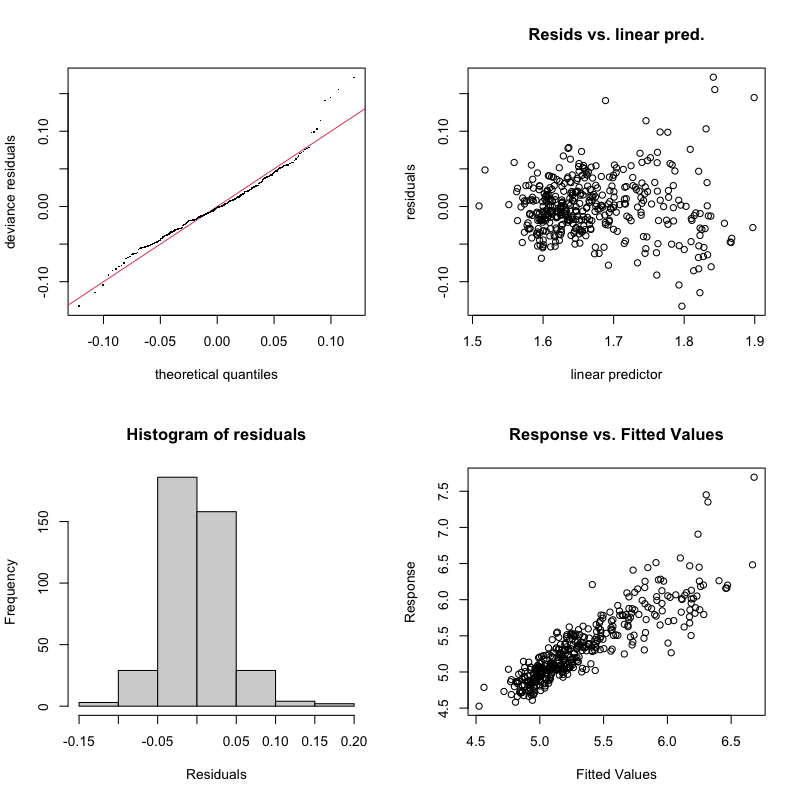

# Smooths A
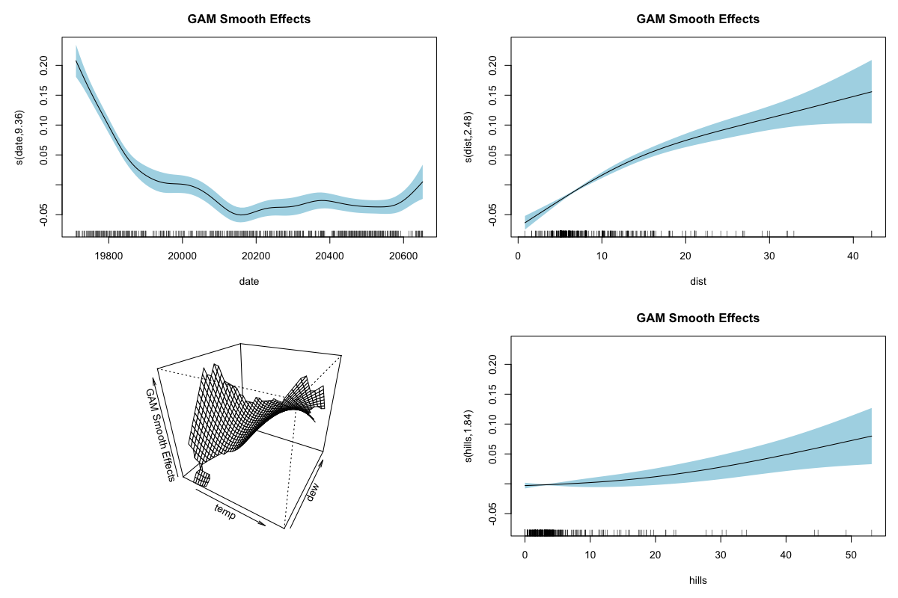

# Smooths B
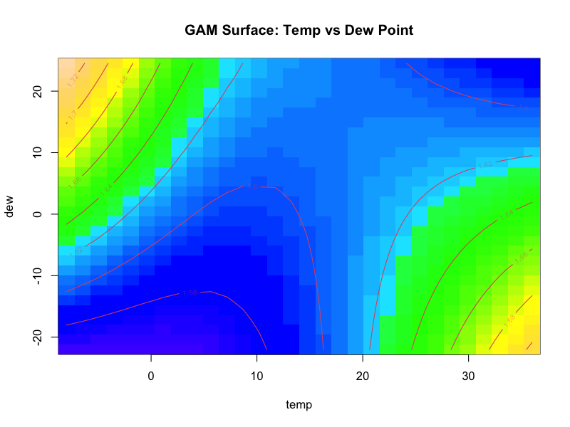

# ACF
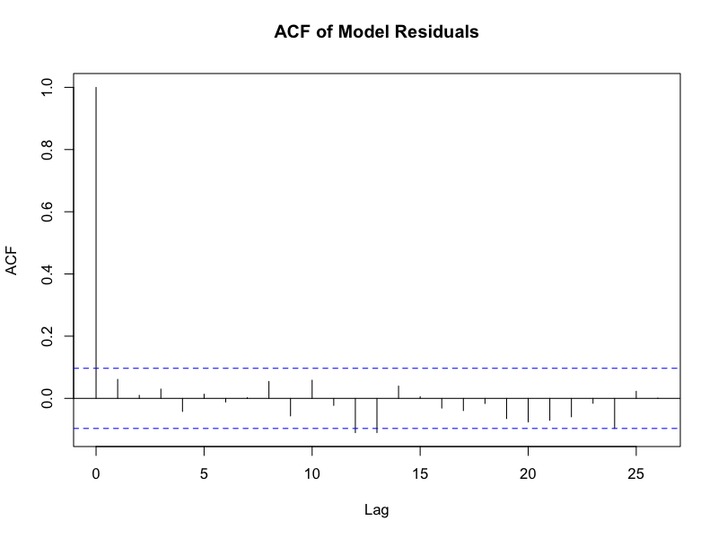

# Predictions
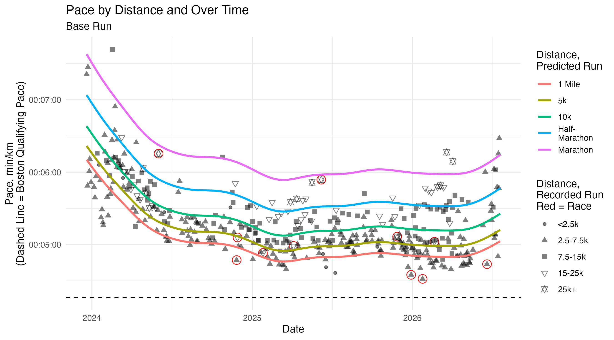

# Predictions Marathon
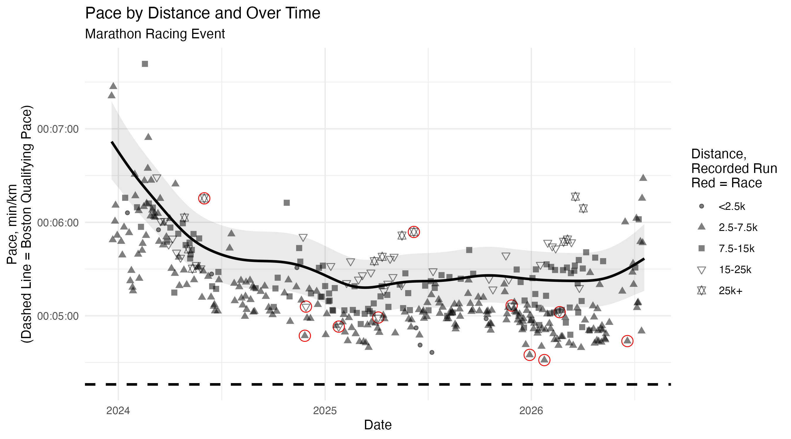

# Predictions Race
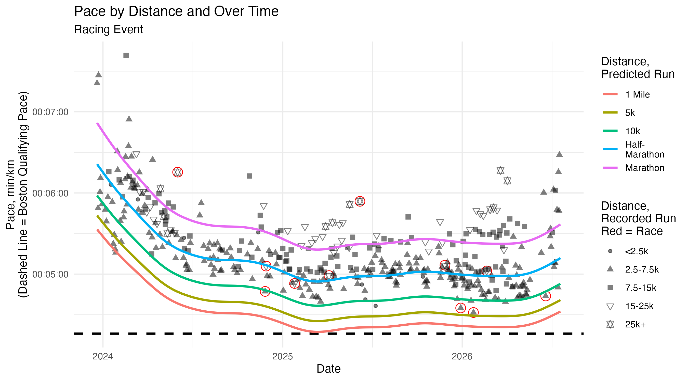

# Predictions Today
```text

+---------------+---------+-----------+------------+------------+
| type          | dist    | pred      | pred_lower | pred_upper |
+===============+=========+===========+============+============+
| Easy Effort   | 1.60934 | 5M 32.58S | 5M 19.98S  | 5M 45.68S  |
+---------------+---------+-----------+------------+------------+
| Easy Effort   | 5       | 5M 42.86S | 5M 30.21S  | 5M 56S     |
+---------------+---------+-----------+------------+------------+
| Easy Effort   | 10      | 5M 57.57S | 5M 44.29S  | 6M 11.36S  |
+---------------+---------+-----------+------------+------------+
| Easy Effort   | 21.0975 | 6M 20.74S | 6M 5.9S    | 6M 36.18S  |
+---------------+---------+-----------+------------+------------+
| Easy Effort   | 42.195  | 6M 51.17S | 6M 23.64S  | 7M 20.68S  |
+---------------+---------+-----------+------------+------------+
| Medium Effort | 1.60934 | 5M 2.77S  | 4M 52.98S  | 5M 12.89S  |
+---------------+---------+-----------+------------+------------+
| Medium Effort | 5       | 5M 12.13S | 5M 2.39S   | 5M 22.18S  |
+---------------+---------+-----------+------------+------------+
| Medium Effort | 10      | 5M 25.52S | 5M 15.27S  | 5M 36.1S   |
+---------------+---------+-----------+------------+------------+
| Medium Effort | 21.0975 | 5M 46.61S | 5M 34.99S  | 5M 58.63S  |
+---------------+---------+-----------+------------+------------+
| Medium Effort | 42.195  | 6M 14.31S | 5M 50.83S  | 6M 39.37S  |
+---------------+---------+-----------+------------+------------+
| Hard Effort   | 1.60934 | 4M 56.21S | 4M 46.27S  | 5M 6.5S    |
+---------------+---------+-----------+------------+------------+
| Hard Effort   | 5       | 5M 5.37S  | 4M 55.37S  | 5M 15.71S  |
+---------------+---------+-----------+------------+------------+
| Hard Effort   | 10      | 5M 18.47S | 5M 7.83S   | 5M 29.47S  |
+---------------+---------+-----------+------------+------------+
| Hard Effort   | 21.0975 | 5M 39.1S  | 5M 27.05S  | 5M 51.6S   |
+---------------+---------+-----------+------------+------------+
| Hard Effort   | 42.195  | 6M 6.21S  | 5M 43S     | 6M 30.99S  |
+---------------+---------+-----------+------------+------------+
| Race Effort   | 1.60934 | 4M 32.38S | 4M 21.17S  | 4M 44.06S  |
+---------------+---------+-----------+------------+------------+
| Race Effort   | 5       | 4M 40.8S  | 4M 29.43S  | 4M 52.64S  |
+---------------+---------+-----------+------------+------------+
| Race Effort   | 10      | 4M 52.84S | 4M 40.86S  | 5M 5.32S   |
+---------------+---------+-----------+------------+------------+
| Race Effort   | 21.0975 | 5M 11.81S | 4M 58.94S  | 5M 25.24S  |
+---------------+---------+-----------+------------+------------+
| Race Effort   | 42.195  | 5M 36.74S | 5M 15.98S  | 5M 58.87S  |
+---------------+---------+-----------+------------+------------+
```
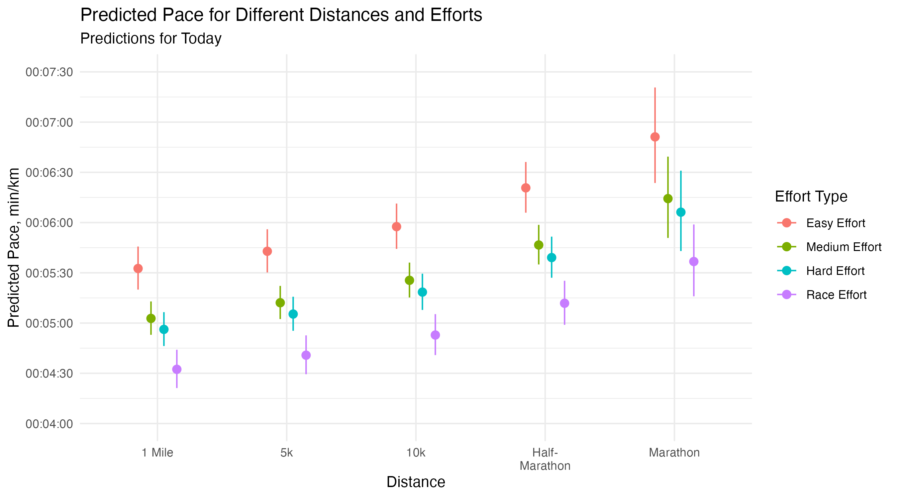

# Running Summary Table
```text

+---------+---------------+----------------+------------+------------+
| yr      | weekave_peryr | monthave_peryr | yr_start   | yr_end     |
+=========+===============+================+============+============+
| 2023.00 | 17.60         | 75.42          | 2023-12-20 | 2023-12-31 |
+---------+---------------+----------------+------------+------------+
| 2024.00 | 21.98         | 94.21          | 2024-01-01 | 2024-12-31 |
+---------+---------------+----------------+------------+------------+
| 2025.00 | 27.25         | 116.80         | 2025-01-01 | 2025-12-31 |
+---------+---------------+----------------+------------+------------+
| 2026.00 | 32.91         | 141.03         | 2026-01-01 | 2026-07-20 |
+---------+---------------+----------------+------------+------------+
```
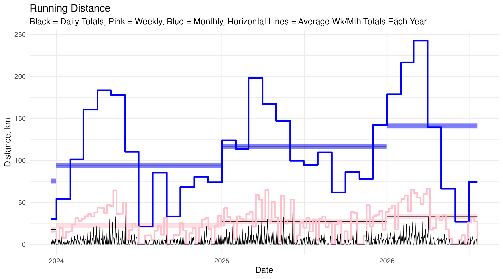

# Heart Rate Zones
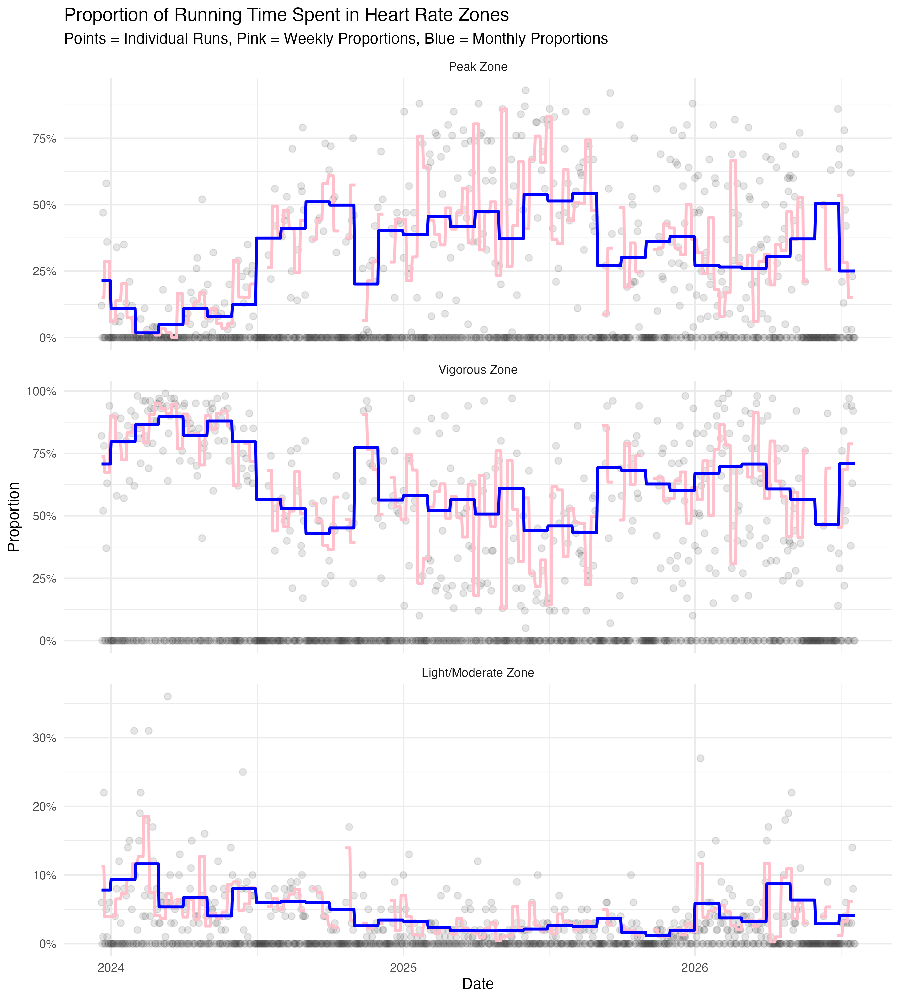

# Distance Histogram
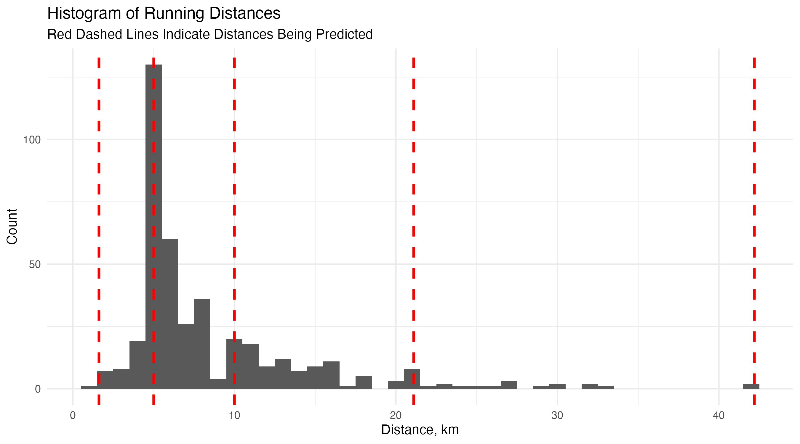

# Text Summary
```text
Upcoming Race: Antelope Island Half Marathon
Date: Oct 9, 2026
[1] "5M 33.921188S"     "1H 57M 24.902262S"


Total Distance Tracker
Celebrate at 4,880 km and multiples of that
[1] 3545.594


Shoe Tracker
Retire daily trainers at ≥600km, Nylon plate shoes at ≥500km, and CF plate shoes at ≥400km
   shoe     sh_type total_dist
1     1   Daily Max   754.3850
2     2   Daily Max   447.4735
3     3   Daily Max   507.7750
4     4   Daily Max   456.0650
5     5   Daily Max   593.7775
6     6   Daily Max   325.8376
7     7   Daily Max   193.4800
8     8 Nylon Plate   128.4200
9     9    CF Plate    60.9800
10   10   Daily Max    77.4000

```

# Analysis R Script
```r
# Clear workspace and load libraries
rm(list = ls())

# Libraries and packages
library(dplyr)
library(ggplot2)
library(tidyr)
library(forcats)
library(tibble)
library(lubridate)
library(hms)
library(mgcv)
library(googlesheets4)
library(googledrive)
library(modelsummary)

# # Authentication and Drive info (for workflow run, comment out if running on my computer)
# gs4_auth(path = "google_auth.json")
# drive_auth(path = "google_auth.json")

# Authentication and Drive info (for local run, comment out if running the workflow)
setwd("~/Documents/GitHub/running-log")
gs4_auth()
drive_auth()

# The ID of the Google Drive folder
target_folder <- as_id("1SS550vx5XmxcQI5byIZ_SRVLbKm-z98F")

# A function to handle outliers in both directions for a variable
transform_num <- function(x) {
  result <- rep(NA_real_, length(x))
  result[which(x == 0)] <- 0
  result[which(x > 0)] <- log1p(x[which(x > 0)])
  result[which(x < 0)] <- -log1p(-x[which(x < 0)])
  return(result)
}

# gg theme
theme_set(theme_minimal())

# Read in data
running <- read_sheet("https://docs.google.com/spreadsheets/d/1O_r313XFN5TJK8Edr80UpJcLwDXKNep2gI0Ga8LmnHE/edit?usp=sharing",
                      skip = 2)

# Clean data a bit and create new variables
running <- running %>%
  mutate(date = as.numeric(ymd(date)),
         start_time = as.numeric(as_hms(start_time)) / 3600,
         afternoon = if_else(start_time > 12.5, 1, 0),
         dist_fac = cut(dist, breaks = c(0, 2.5, 7.5, 15, 25, Inf),
                        labels = c("0-2.5", "2.5-7.5", "7.5-15", "15-25", "25+")),
         dist_log = log1p(dist),
         duration = ymd_hms(duration) - ymd_hms("1899-12-30 00:00:00"),
         pace = as.numeric(ymd_hms(pace) - ymd_hms("1899-12-30 00:00:00")),
         type = case_when(
           type %in% c("Race") ~ "Race Effort",
           type %in% c("Fast", "Interval") ~ "Hard Effort",
           type %in% c("Base", "Hill", "Marathon Race Pace", "Tempo", "Three-One") ~ "Medium Effort",
           type %in% c("Easy") ~ "Easy Effort",
           .default = type
         ) %>% factor(levels = c("Easy Effort", "Medium Effort", "Hard Effort", "Race Effort")),
         race = fct_other(type, keep = "Race Effort", other_level = "Non-Race") %>%
           fct_relevel("Non-Race"),
         surface = factor(surface, levels = c("Road", "Treadmill", "Track")),
         elevation = case_when(
           elevation <= 800 ~ "Low Elevation",
           elevation > 800 & elevation <= 1600 ~ "Base Elevation",
           elevation > 1600 ~ "High Elevation",
           .default = as.character(elevation)
         ),
         elevation = fct_relevel(elevation, "Base Elevation", "Low Elevation", "High Elevation")) %>%
  # Now create a variable for shoe mileage, after first making sure the data is
  # in order by date (though that should already be the case)
  arrange(as.Date(date)) %>%
  group_by(shoe) %>%
  mutate(shoe_dist = cumsum(dist)) %>%
  ungroup() %>%
  relocate(date, start_time, afternoon, dist, dist_log, dist_fac, duration, pace,
           gain, change, hills, net_change, inj_ill, sleep, vigorous, peak,
           type, race, surface, elevation, temp, dew, sun, weather, shoe, sh_type)

# Model
my_mod <- gam(pace ~ s(date, k = 21) + # change over time, one of main predictors
                s(dist, k = 4) + # distance effect, other main predictor
                weather + sun + te(temp, dew, k = 4) + # run conditions
                type + s(hills, k = 4) + surface + afternoon + elevation + # run characteristics
                # NOTE: Add s(net_change) if I get enough data to have it be accurate
                inj_ill + sleep, # personal and equipment conditions
              data = running,
              method = "REML",
              family = Gamma(link = "log"))
coef_names <- c("Intercept", "Weather (0 = Good, 0.5 = Okay, 1 = Bad)",
                "Sun (0 = Cloudy, 0.5 = Partly Cloudy, 1 = Sunny)",
                "Medium Effort Run (vs. Easy)", "Hard Effort Run (vs. Easy)",
                "Race Effort Run (vs. Easy)", "Treadmill (vs. Road)",
                "Track (vs. Road)", "Time of Run (0/1, 1 = After Noon)",
                "Low Elevation (vs. Base)", "High Elevation (vs. Base)",
                "Health Status (0/1, 1 = Recently Injured or Ill)",
                "Sleep Score",
                "Date (Smooth)", "Distance (Smooth)",
                "Temperature and Dew Point (Smooth)", "Hills (Smooth)")
# Using Gamma function because, based on the response vs. fitted values plot,
# it seems like the variance increases with the mean
# Using log link so that predictions are always positive
# Note that interpretation of coefficients is on the log scale, so interpret
# them as percent changes (e.g. 0.02 = 2% increase in pace)
# Once I have enough race data, I might want to do s(dist, by = race) as a
# term to allow for different distance effects based on whether it
# was a race

# Google Drive files to be able to address the model
# Overall look at variables
datasummary_skim(running, output = "model_1skim.txt")
skim_num_df <- datasummary_skim(running, type = "numeric", output = "data.frame") %>%
  select(-any_of(c("Histogram", "Var.1", "Unique", "Missing Pct.")))
colnames(skim_num_df) <- c("Variable", "Mean", "SD", "Min", "Med", "Max")
skim_num_md <- knitr::kable(skim_num_df, format = "markdown", digits = 1)
skim_cat_df <- datasummary_skim(running, type = "categorical", output = "data.frame") %>%
  select(-any_of(c("Var.1")))
colnames(skim_cat_df) <- c("Variable", "Category", "N", "%")
skim_cat_md <- knitr::kable(skim_cat_df, format = "markdown", digits = 1)
# Coefficients Table
modelsummary(my_mod,
             output = "model_1summary.txt",
             title = "Running Pace GAM Model, Gamma Function with Log Link",
             stars = TRUE,
             coef_rename = coef_names,
             exponentiate = TRUE,
             statistic = "conf.int",
             conf_level = 0.95)
# GAM Diagnostics on the Smooths and Overall Model
gam_diagnostics <- capture.output(gam.check(my_mod))
writeLines(gam_diagnostics, "model_2gamcheck.txt")
png("model_2gamcheck.png", width = 800, height = 800, res = 100)
par(mfrow = c(2, 2)) # Forces the 4 plots into a 2x2 grid
gam.check(my_mod)
dev.off() # Closes the canvas and saves the file

# Smooths
png("model_3smoothsA.png", width = 1200, height = 800, res = 100)
plot(my_mod, 
     pages = 1, 
     scheme = 1, 
     shade.col = "lightblue",
     main = "GAM Smooth Effects") 
dev.off()

# Temperature and Dew Tensor Product Smooth
png("model_3smoothsB.png", width = 800, height = 600, res = 100)
vis.gam(my_mod, 
        view = c("temp", "dew"), 
        plot.type = "contour", # or "persp" for 3D
        color = "topo", 
        main = "GAM Surface: Temp vs Dew Point")
dev.off()

# Autocorrelation Function
png("model_4acf.png", width = 800, height = 600, res = 100)
acf(resid(my_mod), main = "ACF of Model Residuals")
dev.off()

# Just a note for one of the things put on the graph: the Boston Qualifying Time
# for my age group for 2026 is 3:00:00, which is a pace of 4:16 min/km

# Predicted Pace
# New Data
# Paces to predict
fig_width <- 9
fig_height <- 5
my_dists <- c(1.60934, 5, 10, 21.0975, 42.195)
n_dists <- length(my_dists)
my_daterange <- seq(min(running$date, na.rm = TRUE),
                    as.numeric(Sys.Date()))
n_dates <- length(my_daterange)
new_data <- tibble(
  date = rep(my_daterange, n_dists),
  dist = rep(my_dists, each = n_dates), # distances above,
  weather = 0, # not raining or bad weather
  sun = 0.5, # Partially sunny
  temp = mean(running$temp, na.rm = TRUE), # average temp
  dew = mean(running$dew, na.rm = TRUE), # average dew point
  type = factor("Medium Effort", levels = levels(running$type)), # A base run
  hills = mean(running$hills, na.rm = TRUE), # hilliness metric
  # net_change = mean(running$net_change, na.rm = TRUE), # net elevation change
  surface = factor("Road", levels = c("Road", "Treadmill", "Track")),
  afternoon = 0, # not afternoon
  elevation = factor("Base Elevation", # normal elevation for my runs
                     levels = c("Base Elevation", "Low Elevation", "High Elevation")),
  inj_ill = 0, # no injury or illness
  sleep = mean(running$sleep, na.rm = TRUE) # average sleep score
)
preds <- predict(my_mod, newdata = new_data, se.fit = TRUE)
# Note: Using exponentiation below rather than type = "response" in the predict
# function because I want to get standard errors on the log scale and then
# transform those to the response scale
new_data <- new_data %>%
  mutate(date = as.Date(date),
         dist = factor(dist),
         # Step 1: Calculate limits on the Log Scale
         log_fit   = preds$fit,
         log_lower = preds$fit - 1.96 * preds$se.fit,
         log_upper = preds$fit + 1.96 * preds$se.fit,
         # Step 2: Exponentiate to get back to "Minutes per km"
         # Then multiply by 60 to get seconds for the hms() function
         pred       = lubridate::hms(hms::hms(exp(log_fit) * 60)),
         pred_lower = lubridate::hms(hms(exp(log_lower) * 60)),
         pred_upper = lubridate::hms(hms(exp(log_upper) * 60)))
shapes <- c(20, 17, 15, 6, 11)
g_out <- ggplot() +
  geom_hline(yintercept = period(minutes = 4, seconds = 16),
             linetype = "dashed") +
  geom_point(data = running %>% filter(type == "Race Effort"),
             aes(x = as.Date(date), y = hms(pace * 60)),
             size = 4, shape = 1, color = "red") +
  geom_point(data = running, aes(x = as.Date(date), y = hms(pace * 60),
                                 shape = dist_fac),
             alpha = 0.5, size = 2) +
  geom_line(data = new_data, aes(x = date, y = pred, color = dist, group = dist),
            linewidth = 1) +
  scale_shape_manual(values = shapes,
                     labels = c("<2.5k", "2.5-7.5k", "7.5-15k", "15-25k", "25k+")) +
  scale_color_discrete(labels = c("1 Mile", "5k", "10k", "Half-\nMarathon", "Marathon")) +
  labs(title = "Pace by Distance and Over Time",
       subtitle = "Base Run",
       x = "Date",
       y = "Pace, min/km\n(Dashed Line = Boston Qualifying Pace)",
       shape = "Distance,\nRecorded Run\nRed = Race",
       color = "Distance,\nPredicted Run")
g_out
ggsave("running_1.png", g_out, width = fig_width, height = fig_height, dpi = 300, bg = "white")

# Racing predicted values
race_data <- tibble(
  date = rep(my_daterange, n_dists),
  dist = rep(my_dists, each = n_dates), # distances above,
  weather = 0, # not raining or bad weather
  sun = 0.5, # Partially sunny
  temp = mean(running$temp, na.rm = TRUE), # average temp
  dew = mean(running$dew, na.rm = TRUE), # average dew point
  type = factor("Race Effort", levels = levels(running$type)), # A race
  hills = mean(running$hills, na.rm = TRUE), # hilliness metric
  # net_change = mean(running$net_change, na.rm = TRUE), # net elevation change
  surface = factor("Road", levels = c("Road", "Treadmill", "Track")),
  afternoon = 0, # not afternoon
  elevation = factor("Base Elevation", # normal elevation for my runs
                     levels = c("Base Elevation", "Low Elevation", "High Elevation")),
  inj_ill = 0, # no injury or illness
  sleep = mean(running$sleep, na.rm = TRUE) # average sleep score
)
preds_race <- predict(my_mod, newdata = race_data, se.fit = TRUE)
race_data <- race_data %>%
  mutate(date = as.Date(date),
         dist = factor(dist),
         # Step 1: Calculate limits on the Log Scale
         log_fit   = preds_race$fit,
         log_lower = preds_race$fit - 1.96 * preds_race$se.fit,
         log_upper = preds_race$fit + 1.96 * preds_race$se.fit,
         # Step 2: Exponentiate to get back to "Minutes per km"
         # Then multiply by 60 to get seconds for the hms() function
         pred       = lubridate::hms(hms::hms(exp(log_fit) * 60)),
         pred_lower = lubridate::hms(hms(exp(log_lower) * 60)),
         pred_upper = lubridate::hms(hms(exp(log_upper) * 60)))
# Racing plots
g_out_2 <- ggplot(race_data %>% filter(dist == "42.195"),
                  aes(x = date)) +
  geom_hline(yintercept = period(minutes = 4, seconds = 16),
             linewidth = 1, linetype = "dashed") +
  geom_point(data = running %>% filter(type == "Race Effort"),
             aes(x = as.Date(date), y = hms(pace * 60)),
             size = 4, shape = 1, color = "red") +
  geom_point(data = running, aes(x = as.Date(date), y = hms(pace * 60),
                                 shape = dist_fac),
             alpha = 0.5, size = 2) +
  geom_line(aes(y = pred), linewidth = 1) +
  geom_ribbon(aes(ymin = pred_lower, ymax = pred_upper), alpha = 0.1) +
  scale_shape_manual(values = shapes,
                     labels = c("<2.5k", "2.5-7.5k", "7.5-15k", "15-25k", "25k+")) +
  labs(title = "Pace by Distance and Over Time",
       subtitle = "Marathon Racing Event",
       x = "Date",
       y = "Pace, min/km\n(Dashed Line = Boston Qualifying Pace)",
       shape = "Distance,\nRecorded Run\nRed = Race",
       color = "Distance,\nPredicted Run")
g_out_2
ggsave("running_2.png", g_out_2, width = fig_width, height = fig_height, dpi = 300, bg = "white")
g_out_3 <- ggplot() +
  geom_hline(yintercept = period(minutes = 4, seconds = 16),
             linewidth = 1, linetype = "dashed") +
  geom_point(data = running %>% filter(type == "Race Effort"),
             aes(x = as.Date(date), y = hms(pace * 60)),
             size = 4, shape = 1, color = "red") +
  geom_point(data = running, aes(x = as.Date(date), y = hms(pace * 60),
                                 shape = dist_fac),
             alpha = 0.5, size = 2) +
  geom_line(data = race_data, aes(x = date, y = pred, color = dist, group = dist),
            linewidth = 1) +
  scale_shape_manual(values = shapes,
                     labels = c("<2.5k", "2.5-7.5k", "7.5-15k", "15-25k", "25k+")) +
  scale_color_discrete(labels = c("1 Mile", "5k", "10k", "Half-\nMarathon", "Marathon")) +
  labs(title = "Pace by Distance and Over Time",
       subtitle = "Racing Event",
       x = "Date",
       y = "Pace, min/km\n(Dashed Line = Boston Qualifying Pace)",
       shape = "Distance,\nRecorded Run\nRed = Race",
       color = "Distance,\nPredicted Run")
g_out_3
ggsave("running_3.png", g_out_3, width = fig_width, height = fig_height, dpi = 300, bg = "white")

# Make a summary table of predictions for an easy effort, medium effort, hard
# effort, and race effort if I were to do a run today
my_efforts <- levels(running$type)
today_dat <- tibble(
  date = as.numeric(Sys.Date()),
  dist = rep(my_dists, length(my_efforts)), # distances above,
  weather = 0, # not raining or bad weather
  sun = 0.5, # Partially sunny
  temp = mean(running$temp, na.rm = TRUE), # average temp
  dew = mean(running$dew, na.rm = TRUE), # average dew point
  type = factor(rep(my_efforts, each = length(my_dists)), levels = levels(running$type)),
  hills = mean(running$hills, na.rm = TRUE), # hilliness metric
  # net_change = mean(running$net_change, na.rm = TRUE), # net elevation change
  surface = factor("Road", levels = c("Road", "Treadmill", "Track")),
  afternoon = 0, # not afternoon
  elevation = factor("Base Elevation", # normal elevation for my runs
                     levels = c("Base Elevation", "Low Elevation", "High Elevation")),
  inj_ill = 0, # no injury or illness
  sleep = mean(running$sleep, na.rm = TRUE))
today_preds <- predict(my_mod, newdata = today_dat, se.fit = TRUE)
today_paces <- today_dat %>%
  mutate(
    date = as.Date(date),
    dist = factor(dist),
    log_fit   = today_preds$fit,
    log_lower = today_preds$fit - 1.96 * today_preds$se.fit,
    log_upper = today_preds$fit + 1.96 * today_preds$se.fit,
    pred_sec       = exp(log_fit) * 60,
    pred_lower_sec = exp(log_lower) * 60,
    pred_upper_sec = exp(log_upper) * 60,
    pred       = lubridate::hms(hms::hms(pred_sec)),
    pred_lower = lubridate::hms(hms::hms(pred_lower_sec)),
    pred_upper = lubridate::hms(hms::hms(pred_upper_sec))
  ) %>%
  select(type, dist, pred_sec, pred_lower_sec, pred_upper_sec, pred, pred_lower, pred_upper)
pd <- position_dodge(width = 0.4)
g_out_3.5 <- ggplot(today_paces, aes(x = dist, y = pred_sec, color = type, group = type)) +
  geom_errorbar(
    aes(ymin = pred_lower_sec, ymax = pred_upper_sec),
    width = 0, 
    position = pd
  ) +
  geom_point(
    size = 2.5, 
    position = pd
  ) +
  scale_x_discrete(labels = c("1 Mile", "5k", "10k", "Half-\nMarathon", "Marathon")) +
  scale_y_continuous(
    limits = c(240, 450),
    breaks = seq(240, 450, by = 30),
    labels = function(x) hms::hms(x)
  ) +
  labs(
    title = "Predicted Pace for Different Distances and Efforts",
    subtitle = "Predictions for Today",
    x = "Distance",
    y = "Predicted Pace, min/km",
    color = "Effort Type"
  )
ggsave("running_3.5.png", g_out_3.5,
       width = fig_width, height = fig_height, dpi = 300, bg = "white")
datasummary_df(today_paces |> select(type, dist, pred, pred_lower, pred_upper),
               "running_3.5.txt")

race_data <- race_data %>%
  mutate(date = as.Date(date),
         dist = factor(dist),
         # Step 1: Calculate limits on the Log Scale
         log_fit   = preds_race$fit,
         log_lower = preds_race$fit - 1.96 * preds_race$se.fit,
         log_upper = preds_race$fit + 1.96 * preds_race$se.fit,
         # Step 2: Exponentiate to get back to "Minutes per km"
         # Then multiply by 60 to get seconds for the hms() function
         pred       = lubridate::hms(hms::hms(exp(log_fit) * 60)),
         pred_lower = lubridate::hms(hms(exp(log_lower) * 60)),
         pred_upper = lubridate::hms(hms(exp(log_upper) * 60)))


# Make a plot of my running distance over time, but with weekly (pink) and
# monthly (blue) moving averages
# First I need to fill in the zero days
running_full <- running %>%
  mutate(date = as.Date(date)) %>%
  complete(date = as.Date(my_daterange)) %>%
  mutate(dist = if_else(is.na(dist), 0, dist),
         week_start = floor_date(date, "week", week_start = 1),
         month_start = floor_date(date, "month"),
         yr = year(date)) %>%
  group_by(week_start) %>%
  mutate(dist_weekly = sum(dist)) %>%
  ungroup() %>%
  group_by(month_start) %>%
  mutate(dist_monthly = sum(dist)) %>%
  ungroup()
running_summary <- running_full %>%
  group_by(yr) %>%
  summarize(
    weekave_peryr = sum(dist) / (n() / 7),
    monthave_peryr = sum(dist) / (n() / 30),
    yr_start = min(date),
    yr_end = max(date),
    .groups = "drop"
  )
g_out_4 <- running_full %>%
  ggplot(aes(x = date, y = dist)) +
  geom_segment(data = running_summary,
               aes(y = monthave_peryr, yend = monthave_peryr,
                   x = yr_start, xend = yr_end),
               color = "blue", linewidth = 3, alpha = 0.5) +
  geom_segment(data = running_summary,
               aes(y = monthave_peryr, yend = monthave_peryr,
                   x = yr_start, xend = yr_end),
               color = "black", linewidth = 0.25) +
  geom_segment(data = running_summary,
               aes(y = weekave_peryr, yend = weekave_peryr,
                   x = yr_start, xend = yr_end),
               color = "pink", linewidth = 3, alpha = 0.5) +
  geom_segment(data = running_summary,
               aes(y = weekave_peryr, yend = weekave_peryr,
                   x = yr_start, xend = yr_end),
               color = "black", linewidth = 0.25) +
  geom_step(aes(y = dist_monthly), color = "blue", linewidth = 1) +
  geom_step(aes(y = dist_weekly), color = "pink", linewidth = 1) +
  geom_line(linewidth = 0.25) +
  labs(title = "Running Distance",
       subtitle = "Black = Daily Totals, Pink = Weekly, Blue = Monthly, Horizontal Lines = Average Wk/Mth Totals Each Year",
       x = "Date",
       y = "Distance, km")
g_out_4
ggsave("running_4.png", g_out_4, width = fig_width, height = fig_height, dpi = 300, bg = "white")
datasummary_df(running_summary, "running_4.txt")

# Make a plot showing the proportion of my time running that is spent in the
# peak heart rate zone
# The main variable of interest is peak, which is the percentage of a given run
# spent in the peak heart rate zone, from 0 to 100
# For a given period, I should take (100 - peak) and multiply it, for each run,
# by the duration of the run — then, divide that by the total duration of all
# runs in that period, to get the proportion of time not spent in the peak zone
# Note that the duration variable is already in minutes
# Note that, in contrast to the running distance graph produced above, I want
# this to be a moving calculation, so I will do it with a rolling window
# I want to do this just for a moving 30-day period
# Lastly note that I want this to be a moving 30-day period, and not all days
# are included in the data, so I will first create a full sequence of dates
running_zones <- running %>%
  mutate(date = as.Date(date)) %>%
  complete(date = as.Date(my_daterange)) %>%
  mutate(week_start = floor_date(date, "week"),
         month_start = floor_date(date, "month"),
         yr = year(date)) %>%
  arrange(date) %>%
  select(date, week_start, month_start, yr, peak, vigorous, duration) %>%
  mutate(peak = if_else(is.na(duration), 0, peak / 100),
         vigorous = if_else(is.na(duration), 0, vigorous / 100),
         light_moderate = if_else(is.na(duration), 0, 1 - peak - vigorous),
         peak_time = peak * duration,
         vigorous_time = vigorous * duration,
         light_moderate_time = light_moderate * duration,
         duration = if_else(is.na(duration), as.difftime(0, units = "mins"), duration),
         peak_time = as.numeric(peak_time),
         vigorous_time = as.numeric(vigorous_time),
         light_moderate_time = as.numeric(light_moderate_time),
         duration = as.numeric(duration)) %>%
  group_by(week_start) %>%
  mutate(prop_peak_week = sum(peak_time, na.rm = TRUE) / sum(duration, na.rm = TRUE),
         prop_vigorous_week = sum(vigorous_time, na.rm = TRUE) / sum(duration, na.rm = TRUE),
         prop_light_moderate_week = sum(light_moderate_time, na.rm = TRUE) / sum(duration, na.rm = TRUE)) %>%
  ungroup() %>%
  group_by(month_start) %>%
  mutate(prop_peak_month = sum(peak_time, na.rm = TRUE) / sum(duration, na.rm = TRUE),
         prop_vigorous_month = sum(vigorous_time, na.rm = TRUE) / sum(duration, na.rm = TRUE),
         prop_light_moderate_month = sum(light_moderate_time, na.rm = TRUE) / sum(duration, na.rm = TRUE)) %>%
  ungroup() %>%
  arrange(date) %>%
  select(date, peak, vigorous, light_moderate, starts_with("prop")) %>%
  rename(prop_peak_day = peak, prop_vigorous_day = vigorous, prop_light_moderate_day = light_moderate) %>%
  pivot_longer(cols = starts_with("prop"),
               names_to = c("zone", ".value"),
               names_pattern = "prop_(.*)_(day|week|month)") %>%
  rename(prop_daily = day, prop_weekly = week, prop_monthly = month) %>%
  # rename values in the zone variable to "Peak Zone", "Vigorous Zone", "Light/Moderate Zone"
  mutate(zone = case_when(
    zone == "peak" ~ "Peak Zone",
    zone == "vigorous" ~ "Vigorous Zone",
    zone == "light_moderate" ~ "Light/Moderate Zone"),
    zone = factor(zone, levels = c("Peak Zone", "Vigorous Zone", "Light/Moderate Zone")))
# Now make the plot
g_out_5 <- running_zones %>%
  ggplot(aes(x = date)) +
  geom_point(aes(y = prop_daily), size = 2, alpha = 0.1) +
  geom_line(aes(y = prop_weekly), color = "pink", linewidth = 1) +
  geom_line(aes(y = prop_monthly), color = "blue", linewidth = 1) +
  scale_y_continuous(labels = scales::percent_format(accuracy = 1)) +
  labs(title = "Proportion of Running Time Spent in Heart Rate Zones",
       subtitle = "Points = Individual Runs, Pink = Weekly Proportions, Blue = Monthly Proportions",
       x = "Date",
       y = "Proportion") +
  facet_wrap(~zone, ncol = 1, scales = "free_y")
g_out_5
ggsave("running_5.png", g_out_5, width = fig_width, height = fig_height * 2, dpi = 300, bg = "white")

# Histogram of distances with the ones I'm predicting marked
g_out_6 <- ggplot(running, aes(x = dist)) +
  geom_histogram(binwidth = 1) +
  geom_vline(xintercept = my_dists, color = "red", linewidth = 1,
             linetype = "dashed") +
  labs(title = "Histogram of Running Distances",
       subtitle = "Red Dashed Lines Indicate Distances Being Predicted",
       x = "Distance, km",
       y = "Count")
g_out_6
ggsave("running_6.png", g_out_6, width = fig_width, height = fig_height, dpi = 300, bg = "white")

# For Antelope Island Half Marathon
my_predict <- tibble(
  date = as.numeric(ymd("2026-10-09")), dist = 21.0975,
  hills = (150 + (150 - (0)))/21.0975,
  inj_ill = 0, sleep = mean(running$sleep),
  type = factor("Race Effort", levels = levels(running$type)),
  surface = factor("Road", levels = c("Road", "Treadmill", "Track")),
  temp = 17, dew = 3, sun = 0.5, afternoon = 0,
  elevation = factor("Base Elevation",
                     levels = c("Base Elevation", "Low Elevation", "High Elevation")),
  weather = 0
) %>%
  predict(my_mod, newdata = .) %>%
  `[`(1) %>%
  exp() %>%
  `*`(c("Predicted Pace" = 60, "Predicted Marathon Time" = 60 * 21.0975)) %>%
  hms::hms() %>%
  lubridate::hms()

# Total distance run
total_dist <- sum(running$dist)
# When I get to 4,880km I want to celebrate (that is the equivalent of running
# across the US)

# Total distance for each pair of shoes
shoes <- running %>%
  group_by(shoe, sh_type) %>%
  summarize(total_dist = sum(dist))
# Should change for new shoes at 500-800km, but since I am a larger guy maybe
# more like 400-600km

# Save out some text
sink("running_7.txt")
cat("Upcoming Race: Antelope Island Half Marathon\n")
cat("Date: Oct 9, 2026\n")
print(my_predict)
cat("\n\n")
cat("Total Distance Tracker\n")
cat("Celebrate at 4,880 km and multiples of that\n")
print(total_dist)
cat("\n\n")
cat("Shoe Tracker\n")
cat("Retire daily trainers at ≥600km, Nylon plate shoes at ≥500km, and CF plate shoes at ≥400km\n")
print(as.data.frame(shoes))
cat("\n")
sink()

# -------------------------------------------------------------------------
# Compile a single Markdown string to render everything for NotebookLM
# -------------------------------------------------------------------------
rmd_text <- c(
  "---",
  "title: 'Running Log Summary'",
  "output: word_document",
  "---",
  "",
  "# Data Summary: Numeric Variables",
  skim_num_md,
  "",
  "# Data Summary: Categorical Variables",
  skim_cat_md,
  "",
  "# Model Summary",
  "```text",
  readLines("model_1summary.txt"),
  "```",
  "",
  "# GAM Diagnostics",
  "```text",
  readLines("model_2gamcheck.txt"),
  "```",
  "",
  "",
  "# Smooths A",
  "",
  "",
  "# Smooths B",
  "",
  "",
  "# ACF",
  "",
  "",
  "# Predictions",
  "",
  "",
  "# Predictions Marathon",
  "",
  "",
  "# Predictions Race",
  "",
  "",
  "# Predictions Today",
  "```text",
  readLines("running_3.5.txt"),
  "```",
  "",
  "",
  "# Running Summary Table",
  "```text",
  readLines("running_4.txt"),
  "```",
  "",
  "",
  "# Heart Rate Zones",
  "",
  "",
  "# Distance Histogram",
  "",
  "",
  "# Text Summary",
  "```text",
  readLines("running_7.txt"),
  "```",
  "",
  "# Analysis R Script",
  "```r",
  readLines("running.R"),
  "```"
)

# Write to file and render to Word
writeLines(rmd_text, "notebooklm_summary.Rmd")
rmarkdown::render("notebooklm_summary.Rmd")

# -------------------------------------------------------------------------
# Google Drive Uploads
# -------------------------------------------------------------------------

# Define files to upload (Removed all PDFs)
files_to_upload <- c(
  "model_1skim.txt", "model_1summary.txt", "model_2gamcheck.txt",
  "model_2gamcheck.png", "model_3smoothsA.png", "model_3smoothsB.png",
  "model_4acf.png", "running_1.png", "running_2.png", "running_3.png",
  "running_3.5.txt", "running_3.5.png", "running_4.png", "running_4.txt",
  "running_5.png", "running_6.png", "running_7.txt", "running.R"
)

# Upload the individual files iteratively
for (file in files_to_upload) {
  if (file.exists(file)) {
    drive_put(media = file, path = target_folder, name = file)
  }
}

# Upload the stitched NotebookLM summary and force conversion to Google Docs
if (file.exists("notebooklm_summary.docx")) {
  drive_put(
    media = "notebooklm_summary.docx", 
    path = target_folder, 
    name = "Running_Log_NotebookLM", 
    type = "document" # This triggers the native Google Docs conversion
  )
}
```
